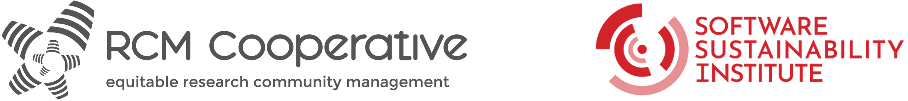

# SSI RCM101: Facilitators Briefing (workshops and clinics)

Dates: 
* Workshop 1 - 23rd July 2025 - 14:00 - 16:00 (BST)
* Clinic 1 - 25th July 2025 - 13:00 - 14:00 (BST)
* Workshop 2 - 13th August 2025 - 14:00 - 16:00 (BST)
* Clinic 2 - 15th August 2025 - 13:00 - 14:00 (BST)

Location: `Zoom link redacted`

# Links (please share in Slack at the appropriate time) :

* Slides: [https://doi.org/10.5281/zenodo.16360045](https://doi.org/10.5281/zenodo.16360045)
* Slack:
    * Invite link: `redacted`
* Miro: 
    * Invite link: `redacted`
    * Board: `redacted`
* Google drive participants-coworking-docs: `redacted`
* Feedback form: 
    * Workshop 1: `redacted`
    * Workshop 2: `redacted`
* Code of conduct: [https://www.software.ac.uk/training/research-software-camps/code-of-conduct](https://www.software.ac.uk/training/research-software-camps/code-of-conduct)  

## Workshop 1 agenda

<table>
  <tr>
   <td><strong>Time</strong>
   </td>
   <td><strong>Activity</strong>
   </td>
   <td><strong>Task</strong>
   </td>
   <td><strong>Activity Lead</strong>
   </td>
   <td><strong>Resources</strong>
   </td>
  </tr>
  <tr>
   <td>14:05 - 14:15
   </td>
   <td>Welcome and intro
   </td>
   <td>Start recording

Remind why we are here, set agenda, meeting practice 

- 10 min pres
   </td>
   <td>Malvika (slide 1-8)
   </td>
   <td>Slides

Miro and note taking google doc

Join zoom call
   </td>
  </tr>
  <tr>
   <td>14:15 - 14:30
   </td>
   <td>Icebreaker
   </td>
   <td>Intro

- 3 min

Breakout conversations

(8 min x 2 breakouts, 2 prompts each room)
   </td>
   <td>Cass (slides 9-11)
   </td>
   <td>Slides

Set up breakout rooms (Malvika)

8 min timer: <a href="https://cuckoo.team/ssi-rcm101">https://cuckoo.team/ssi-rcm101</a> 
   </td>
  </tr>
  <tr>
   <td>14:30 - 14:55
   </td>
   <td>Training Part 1
   </td>
   <td>Context

- 5 min pres

- 5 min “purpose” discussion

What is RCM 

- 15 min pres
   </td>
   <td>Malvika (slides 12-15)

Cass (slides 16-28)
   </td>
   <td>Slides
   </td>
  </tr>
  <tr>
   <td>14:55 - 15:05 - 
   </td>
   <td>Break
   </td>
   <td>Comfort break
   </td>
   <td>NA
   </td>
   <td>NA
   </td>
  </tr>
  <tr>
   <td>15:05 - 15:50
   </td>
   <td> Training part 2
   </td>
   <td>RCM Skills 

- 5 min pres

- 15 min solo

- 15 min feedback

- 10 mins buffer for Q&A
   </td>
   <td>Malvika slides 29-35

Cass slides 34-38
   </td>
   <td>Slides 

Miro
   </td>
  </tr>
  <tr>
   <td>15:50 - 16:00
   </td>
   <td>Wrap up and questions
   </td>
   <td>(10 mins)
   </td>
   <td>
   </td>
   <td>
   </td>
  </tr>
  <tr>
   <td>16:00
   </td>
   <td>Close workshop
   </td>
   <td>
   </td>
   <td>
   </td>
   <td>
   </td>
  </tr>
</table>

## Clinic 1 agenda

<table>
  <tr>
   <td><strong>Time</strong>
   </td>
   <td><strong>Activity</strong>
   </td>
   <td><strong>Task</strong>
   </td>
   <td><strong>Lead</strong>
   </td>
   <td><strong>Resources</strong>
   </td>
  </tr>
  <tr>
   <td>13:05 - 13:10
   </td>
   <td>Welcome and intro to community clinic
   </td>
   <td>Introduce format and requirements
   </td>
   <td>Malvika
   </td>
   <td>Shared notes
   </td>
  </tr>
  <tr>
   <td>13:10 - 13:20
   </td>
   <td>Individual identification of issue/problem and time to read others
   </td>
   <td>Participants writing and voting
   </td>
   <td>
   </td>
   <td>Shared notes
   </td>
  </tr>
  <tr>
   <td>13:20 - 13:50
   </td>
   <td>Problem discussions
   </td>
   <td>Start with highest voted issue and Chair discussion
   </td>
   <td>Cass
   </td>
   <td>Shared notes
   </td>
  </tr>
  <tr>
   <td>13:50 - 14:00
   </td>
   <td>Questions and close
   </td>
   <td>Chair 
   </td>
   <td>Malvika
   </td>
   <td>
   </td>
  </tr>
</table>

## Workshop 2 agenda

<table>
  <tr>
   <td><strong>Time</strong>
   </td>
   <td><strong>Activity</strong>
   </td>
   <td><strong>Task</strong>
   </td>
   <td><strong>Lead</strong>
   </td>
   <td><strong>Resources</strong>
   </td>
  </tr>
  <tr>
   <td>14:05 - 14:10
   </td>
   <td>Welcome and intro
   </td>
   <td>Start recording

Remind why we are here, set agenda, meeting practice 
   </td>
   <td>Cass slides 45-46
   </td>
   <td>slides
   </td>
  </tr>
  <tr>
   <td>14:10 - 14:20
   </td>
   <td>Icebreaker
   </td>
   <td>Intro

- 2 min

Breakout conversations

(8 min x 1 breakouts)
   </td>
   <td>Emma slides

Cass manage breakouts
   </td>
   <td>
   </td>
  </tr>
  <tr>
   <td>14:20 - 14:55
   </td>
   <td>Training Part 1: community maturation
   </td>
   <td>Presentation 20 min

Exercise 15 min
   </td>
   <td>Emma slides 49-62 (inc exercise)
   </td>
   <td>slides

miro
   </td>
  </tr>
  <tr>
   <td>14:55 - 15:00
   </td>
   <td>Break
   </td>
   <td>
   </td>
   <td>
   </td>
   <td>
   </td>
  </tr>
  <tr>
   <td>15:00 - 15:30
   </td>
   <td>Training part 2: Managing your community
   </td>
   <td>Presentation 15 min

Exercise 15 min
   </td>
   <td>Cass slides 64-78 (inc exercise)
   </td>
   <td>slides

miro
   </td>
  </tr>
  <tr>
   <td>15:30 - 15:35
   </td>
   <td>Break
   </td>
   <td>
   </td>
   <td>
   </td>
   <td>
   </td>
  </tr>
  <tr>
   <td>15:35 - 15:50
   </td>
   <td>Next steps for your community
   </td>
   <td>Presentation 2 min

Exercise (inc feedback) 13 min
   </td>
   <td>Emma slide 85 (inc exercise)
   </td>
   <td>slides

miro
   </td>
  </tr>
  <tr>
   <td>15:50 - 16:00
   </td>
   <td>Wrap up, clinic, questions
   </td>
   <td>
   </td>
   <td>Cass slides 87-90
   </td>
   <td>slides
   </td>
  </tr>
  <tr>
   <td>16:00
   </td>
   <td>Close workshop
   </td>
   <td>
   </td>
   <td>
   </td>
   <td>
   </td>
  </tr>
</table>

## Clinic 2 agenda

<table>
  <tr>
   <td><strong>Time</strong>
   </td>
   <td><strong>Activity</strong>
   </td>
   <td><strong>Task</strong>
   </td>
   <td><strong>Lead</strong>
   </td>
   <td><strong>Resources</strong>
   </td>
  </tr>
  <tr>
   <td>13:05 - 13:10
   </td>
   <td>Welcome and intro to community clinic
   </td>
   <td>Introduce format and requirements
   </td>
   <td>Cass
   </td>
   <td>Shared notes
   </td>
  </tr>
  <tr>
   <td>13:10 - 13:20
   </td>
   <td>Individual identification of issue/problem and time to read others
   </td>
   <td>Participants writing and voting
   </td>
   <td>
   </td>
   <td>Shared notes
   </td>
  </tr>
  <tr>
   <td>13:20 - 13:50
   </td>
   <td>Problem discussions
   </td>
   <td>Start with highest voted issue and Chair discussion
   </td>
   <td>Malvika
   </td>
   <td>Shared notes
   </td>
  </tr>
  <tr>
   <td>13:50 - 14:00
   </td>
   <td>Questions and close
   </td>
   <td>Chair 
   </td>
   <td>Cass
   </td>
   <td>
   </td>
  </tr>
</table>

