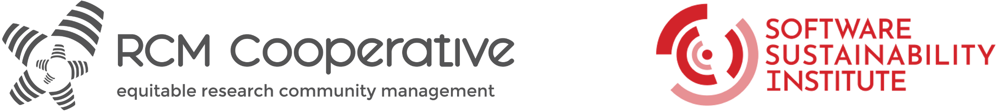

# SSI RCM101: Participants Briefing (workshops and clinics)

---

## Important information**

Dates: 
* Workshop 1 - 23rd July 2025 - 14:00 - 16:00 (BST)
* Clinic 1 - 25th July 2025 - 13:00 - 14:00 (BST)
* Workshop 2 - 13th August 2025 - 14:00 - 16:00 (BST)
* Clinic 2 - 15th August 2025 - 13:00 - 14:00 (BST)

**Zoom link (same for all sessions): `redacted`

### Resources

* Slides:  [https://doi.org/10.5281/zenodo.16360045](https://doi.org/10.5281/zenodo.16360045)
* Recording from workshops will be shared after the workshop via SSI (unlisted and only accessible with direct links): `redacted`
* Miro board for exercises: `redacted`
* GoogleDoc for shared notetaking: `redacted` - Taking notes on the shared document is optional - *if you find too many resources distracting, please stick with Zoom and Miro only.*
* Please note that the [SSI Code of Conduct](https://www.software.ac.uk/training/research-software-camps/code-of-conduct) applies to this workshop. Take a moment to read the details.
* Shared web-based timer for activities like breakout discussions: [https://cuckoo.team/ssi-rcm101](https://cuckoo.team/ssi-rcm101) 

### About us

* [RCM Cooperative website](https://www.rcmcooperative.com/)
* Trainers for Workshop 1 are Cass, Malvika. Emma will join Cass to deliver workshop 2. Sara will join to listen in and provide technical support. [Learn about them](https://www.rcmcooperative.com/#team)
* This workshop has been organised for SSI Fellows!

---

## Table of contents

[1. Purpose of these sessions](#1-purpose-of-these-sessions)
[2. Miro Board activities](#2-miro-board-activities)
[3. Slack](#3-slack)
[4. Workshops and clinics](#4-workshops-and-clinics)
[5. Contact details](#5-contact-details)

## 1. Purpose of these sessions

### Training goals (objectives)

* Learn about **research community management (RCM)** and RCM roles
* Understand **RCM skills, knowledge, and behaviours, **and identify what is needed in your community
* Take away **concepts and framework** that can be practically used in building plans and strategies
* Identify where your **community can be better supported**
* Explore community-building approaches and support for SSI Fellows' community activities
* Provide space for peer reflection on community issues and problems

### Meeting practice

1. Follow the participant briefing for all information and links needed (also shared in zoom)
2. You can use Written (W) or Spoken (S) options to interact - please edit your username to indicate your preference by adding** W or S in front of your name**
3. We’d love to see you, so please turn on your camera if you can - take a break if needed.
4. All questions are welcome through chat and by raising a virtual hand (Zoom ✋)
5. You can take notes for future reference - we have shared notes. Please credit contributions!
6. Cass, Malvika, and Emma are your trainers - they will keep things moving on time!
7. Connect with them and others on Slack #ssi-rcm101. We will share resources there.

## 2. Miro Board activities

We will be working collaboratively on a custom Miro board to enable flexible collection and integration of your expertise. 

### Accessing the Miro board

You will receive an email invitation to access the Miro board. Please follow the instructions in the email from Miro to interact with the material.

### Zoomed out view

On the bottom right of your web browser, you will see the zoom control as shown below. 

*Figure 1. Miro zoom control on the bottom right of your web browser. Click “+” to zoom in and “-“ to zoom out.*

Initially, we suggest you zoom out so you can see all the “Frames” on the board. 

## 3. Slack**

We will use the RCM Cooperative Slack Workspace for informal conversations between participants before, during and after these workshops. This is a space for you to connect around issues relating to the management of research communities.

You will have a private channel for participants in this workshop (#ssi-rcm101), and access to the other public channels in the workspace.

If you are not familiar with using Slack, you may find this [Quick Start Guide from The Turing Way](https://book.the-turing-way.org/community-handbook/communication-channels/slack-start-guide) helpful.

## 4. Workshops and clinics

**Workshops: **We will use Zoom chat, slides and Miro throughout this workshop.

Taking notes on the shared document is optional - *if you find too many resources distracting, please stick with Zoom and Miro only.*

Resources are also linked at the top of this document for easy reference

* Slides:  [https://doi.org/10.5281/zenodo.16360045](https://doi.org/10.5281/zenodo.16360045)
* Recording from workshops will be shared after the workshop via SSI (unlisted and only accessible with direct links): `redacted`
* Miro board for exercises: `redacted`
* GoogleDoc for shared notetaking: `redacted` - Taking notes on the shared document is optional - *if you find too many resources distracting, please stick with Zoom and Miro only.*
* Please note that the [SSI Code of Conduct](https://www.software.ac.uk/training/research-software-camps/code-of-conduct) applies to this workshop. Take a moment to read the details.
* Shared web-based timer for activities like breakout discussions: [https://cuckoo.team/ssi-rcm101](https://cuckoo.team/ssi-rcm101) 

### What to expect from the Community Clinics?

* Please bring a **critical situation/problem from your community** or a **specific implementation of RCM approaches** that is/was particularly challenging for you to deal with in your project. 
* We as a team will diagnose the issue, share insights and identify **some potential next steps/solutions**. 
* If you have already identified a solution, please don't write it down; you will have an opportunity to share that at the end of the clinic. 
* We will** +1 the issue we want to discuss first**, which would mean that we may use our next clinic to discuss some challenges that we can't get through at this meeting.
* Before the clinic session, please add your notes in the shared document under these prompts:
    * *Community-related challenge that I am currently encountering in my project*
    * *What are the indicators that this issue is particularly challenging?*
    * *Who in your project is involved in addressing it?*
    * *How does solving this issue affect your community?*
* Indicate the type of discussion you'd like to have[^clinic-update]:
    - Solutions/Advice
    - Validation/Empathy
    - Unpacking
    - Alternative Perspectives

## Schedule for Workshop 1 and Clinic 1

### Workshop 1

<table>
  <tr>
   <td><strong>Time</strong>
   </td>
   <td><strong>Activity</strong>
   </td>
   <td><strong>Objectives</strong>
   </td>
  </tr>
  <tr>
   <td>14:05 - 14:15
   </td>
   <td>Welcome and intro
   </td>
   <td>Reinforcing why we are here and the experience we are aiming to create
   </td>
  </tr>
  <tr>
   <td>14:15 - 14:30
   </td>
   <td>Icebreaker
   </td>
   <td>Getting to know each other
   </td>
  </tr>
  <tr>
   <td>14:30 - 14:55
   </td>
   <td>Training Part 1
   </td>
   <td>Learn about community management and RCM roles, and reflect on the purpose of your community
   </td>
  </tr>
  <tr>
   <td>14:55 - 15:05 - 
   </td>
   <td>Break
   </td>
   <td><a href="https://cuckoo.team/ssi-rcm101">https://cuckoo.team/ssi-rcm101</a> 
   </td>
  </tr>
  <tr>
   <td>15:05 - 15:50
   </td>
   <td> Training part 2
   </td>
   <td>Explore the skills and competencies of an RCM, and identify what RCM skills, knowledge and behaviours are needed for your community
   </td>
  </tr>
  <tr>
   <td>15:50 - 16:00
   </td>
   <td>Wrap up and questions
   </td>
   <td>Time to share insights, ask questions and learn about the next steps
   </td>
  </tr>
</table>

### Clinic 1

<table>
  <tr>
   <td><strong>Time</strong>
   </td>
   <td><strong>Activity</strong>
   </td>
  </tr>
  <tr>
   <td>13:05 - 13:10
   </td>
   <td>Welcome to the community clinic
   </td>
  </tr>
  <tr>
   <td>13:10 - 13:20
   </td>
   <td>Individual identification of issue/problem and time to read others
   </td>
  </tr>
  <tr>
   <td>13:20 - 13:50
   </td>
   <td>Problem discussions
   </td>
  </tr>
  <tr>
   <td>13:50 - 14:00
   </td>
   <td>Questions and close
   </td>
  </tr>
</table>

## Schedule for Workshop 2 and Clinic 2

### Workshop 2

<table>
  <tr>
   <td><strong>Time</strong>
   </td>
   <td><strong>Activity</strong>
   </td>
  </tr>
  <tr>
   <td>14:05 - 14:10
   </td>
   <td>Welcome and intro
   </td>
  </tr>
  <tr>
   <td>14:10 - 14:55
   </td>
   <td>Training Part 1: Community Maturation
   </td>
  </tr>
  <tr>
   <td>14:55 - 15:00
   </td>
   <td>Break
   </td>
  </tr>
  <tr>
   <td>15:00 - 15:30
   </td>
   <td>Training part 2: Managing your community
   </td>
  </tr>
  <tr>
   <td>15:30 - 15:50
   </td>
   <td>Next steps for your community
   </td>
  </tr>
  <tr>
   <td>15:50 - 16:00
   </td>
   <td>Wrap up and questions
   </td>
  </tr>
  <tr>
   <td>16:00
   </td>
   <td>Close workshop
   </td>
  </tr>
</table>

### Clinic 2

<table>
  <tr>
   <td><strong>Time</strong>
   </td>
   <td><strong>Activity</strong>
   </td>
  </tr>
  <tr>
   <td>13:05 - 13:10
   </td>
   <td>Welcome to the community clinic
   </td>
  </tr>
  <tr>
   <td>13:10 - 13:20
   </td>
   <td>Individual identification of the issue/problem and time to read others
   </td>
  </tr>
  <tr>
   <td>13:20 - 13:50
   </td>
   <td>Problem discussions
   </td>
  </tr>
  <tr>
   <td>13:50 - 14:00
   </td>
   <td>Questions and close
   </td>
  </tr>
</table>

## 5. Contact details

For any RCM and RCM Cooperative related questions or information, please reach out to Cass by emailing: [cassandra.gouldvanpraag@rcmcooperative.com](mailto:cassandra.gouldvanpraag@rcmcooperative.com). 

You can also directly reach out to Malvika ([malvika@we-are-ols.org](mailto:malvika@we-are-ols.org)) and Emma ([ekaroune@googlemail.com](mailto:ekaroune@googlemail.com)).

For any SSI-related questions, please reach out to Oscar Seip: [oscar.seip@manchester.ac.uk](mailto:oscar.seip@manchester.ac.uk). 

## Footnotes

[^clinic-update]: This was added for clinic 2, to guide some norms for bevahiour