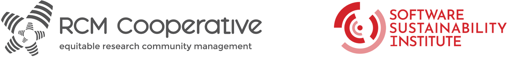

# **SSI RCM 101 Workshops & Clinics**

This is a shared document for Workshop 1 and Clinic 1. Taking notes on the shared document is optional - *if you find too many resources distracting, please stick with Zoom only.*

---

**Important information**

**Dates:** 
* Workshop 1 - 23rd July 2025 - 14:00 - 16:00 (BST)
* Clinic 1 - 25th July 2025 - 13:00 - 14:00 (BST)

**Zoom link:** [redacted] 

**Participant Briefing Document** (shared ahead of the workshop): [SSI RCM101 GitHub Repo](https://github.com/rcmcooperative/SSI-RCM101-Training/blob/main/docs/participants-briefing.md)

Please refer to the briefing document for additional details such as schedule, CoC, trainers, and contact information.

---

# Workshop 1 - 23rd July 2025 - 14:00 - 16:00 (BST)

## Check-in

***Name / pronouns / organisation / socials***
(all fields optional)

* Cass Gould van Praag / she/her / RCM Cooperative / [LinkedIn](https://www.linkedin.com/in/cassandra-gould-van-praag-b8292a16/) 
* Malvika Sharan / she/her / RCM Cooperative & OLS / [GitHub](https://malvikasharan.github.io/) 
* Oscar Seip / he/him / SSI / [LinkedIn](https://www.linkedin.com/in/oscarseip/) 
* Aman Goel / he/him / SSI, University of Manchester / [LinkedIn](https://www.linkedin.com/in/amangoel185/), [GitHub](https://github.com/amangoel185), [Twitter](https://x.com/mightaswellcode)
* Michael Donnay / he/him / SSI / [LinkedIn](https://www.linkedin.com/in/michaeljdonnay/), [Bsky](https://bsky.app/profile/mjdonnay.bsky.social)  
* Robert Chisholm / he/him / Uni of Sheffield / [LinkedIn](https://www.linkedin.com/in/robert-chisholm-ba825780/)
* Jannetta Steyn / she,her / Newcastle University / [LinkedIn](https://www.linkedin.com/in/jannetta/), [Bsky](https://bsky.app/profile/jannettas.bsky.social), [Mastodon](@jannettas@hachyderm.io]
* Riva Quiroga / she, her / OLS / @rivaquiroga,  [LinkedIn](https://www.linkedin.com/in/riva-quiroga/) 
* Sara Villa / she, her/ OLS/ [LinkedIn](https://www.linkedin.com/in/s-villa/)
* Samantha Wittke / she/her / CSC-IT Centre for Science, CodeRefinery, Nordic-RSE, SSI fellow / [LinkedIn](https://www.linkedin.com/in/samantha-wittke-0ab697102/)
* Nicky Nicolson / they/them / Kew Gardens / SSI fellow @nickynicolson most places
* Esther Plomp / she/her / University of Aruba / [mastodon](https://scholar.social/@toothFAIRy) / [LinkedIn](https://www.linkedin.com/in/estherplomp/)
* Alessandro Felder

## Icebreaker prompts: 8 mins x 2

*Please recall and share:*

**Round 1**

1.   A tradition from your culture/context that you enjoy socially. What makes this tradition special?

2.   The most rewarding aspect of your work. What makes it so?

**Round 2**

3.   A community space that makes/made you feel welcome. Why is/was this the case?

4.   A meeting format that helps you engage well. What is special about this format?

## Training Part 1

### What is RCM

* Aman shared this blog post - “Community” is the new “family”: [https://www.chjh.nl/community-is-the-new-family](https://www.chjh.nl/community-is-the-new-family) 

### Reflection Exercise: 2-3 mins

**What is the purpose of your community?** *(Note: Output is not the purpose. Think about what it is that your community is trying to achieve).*

* Cass (**RCM Cooperative**): to connect people with RCM responsibilities and make their work more effective and enjoyable!
* Malvika (***The Turing Way***): Engage researchers on best practices in data science and research and improve those by applying open, reproducible, inclusive and  feminist approaches.
* Esther (**The Turing Way**): engage researchers on best practices in research and model a way of how inclusive, reproducible, collaborative, and ethical science can look like. 
* Samantha (**Nordic-RSE**): a space to connect with people  within the Nordics interested in and enthusiastic about  Research software engineering, to share experiences and ask questions 
* Robert (**SIG-RPC**): A community dedicated to the research, development and advocacy of performance best practices for those that work closely with software.
* Michael (**Society of Research Software Engineering**): create an environment that recognises the importance of [the people who make] research software to the research process; (**Hidden REF**) create a research culture that recognises and rewards the contributions of every member of the research ecosystem.
* Sara (**OLS** and **The Turing Way**):  capacity building and open leadership in a collaborative and equitable way, putting people first
* Oscar (**SSI Fellowship Programme**): To improve and promote good computational practice across all research disciplines and support those who are doing this important work.
* Iain (**Central RSE team**): To develop provision enhancing college-wide research outputs.
* Aman (**RSE **and** SSI)**: To connect like minded folks, provide them with support on all possible fronts - skills, training, connections, knowledge sharing and build an equitable space for co-creation and collaboration.
* Riva (**Programming Historian**): create resources that help people in the humanities and social sciences to learn about computational tools and methods useful for research. (**R-Ladies**):  promote gender diversity in the R community.
* Alessandro (**university-wide Bioimaging community, Global Bioimage Analysis society**): create a space for early career researchers and technical staff to informally present work to a more diverse audience, exchange knowledge and network - resulting in better career opportunities, collaborations and recognition (hopefully).
* Nicky (**biodiversity informatics community)**, curate specimens and data to describe and protect species

## Training part 2

### RCM Skills and Competencies

Using this framework, please identify skills/responsibilities based on the prompts below:

✍️  What skills and resources do you have?

✍️  What skills and resources does your community have?

✍️  Who / what infrastructure from outside can be brought in to fill the gaps

✍️  What upskilling or resources need to be developed within your community?

# Clinic 1: 25th July 2025 - 13:00 - 14:00 (BST)

Please share a critical situation/problem from your community that is/was particularly challenging for you to deal with in your project. 

We as a team will diagnose the issue, share insights, and identify some potential solutions. If you have already identified a solution, please don't write it down; you will have an opportunity to share that at the end of the clinic. 

We will +1 the issue we want to discuss first, which would mean that we may use the next meeting to discuss some challenge that we couldn't get through at this week's meeting.

---

## Check-in

***Name / pronouns / organisation / socials***
(all fields optional)

* Cass Gould van Praag / she/her / RCM Cooperative / [LinkedIn](https://www.linkedin.com/in/cassandra-gould-van-praag-b8292a16/) 
* Malvika Sharan / she/her / RCM Cooperative & OLS / [GitHub](https://malvikasharan.github.io/) 
* Robert Chisholm / he/him / Uni of Sheffield / [LinkedIn](https://www.linkedin.com/in/robert-chisholm-ba825780/)
* Jannetta Steyn / she/her / Newcastle University / [LinkedIn](https://www.linkedin.com/in/jannetta/), [Bsky](https://bsky.app/profile/jannettas.bsky.social), [Mastodon](@jannettas@hachyderm.io]
* Aman Goel / he/him / SSI, University of Manchester / [LinkedIn](https://www.linkedin.com/in/amangoel185/), [GitHub](https://github.com/amangoel185), [Twitter](https://x.com/mightaswellcode)
* Sara Villa / she/her/ OLS/ [LinkedIn](https://www.linkedin.com/in/s-villa/)
* Meag Doherty / she/her / NIH - All of Us
* Oscar Seip / he/him / SSI / [LinkedIn](https://www.linkedin.com/in/oscarseip/) 
* Riva Quiroga / she/her / OLS / @rivaquiroga,  [LinkedIn](https://www.linkedin.com/in/riva-quiroga/) 
* Emma Karoune / she/her/ The Alan Turing Institute
* Esther Plomp / she/her / University of Aruba / [mastodon](https://scholar.social/@toothFAIRy) / [LinkedIn](https://www.linkedin.com/in/estherplomp/)

---

**Template for community clinic problems**

[name]:
* Community-related challenge that I am currently encountering in my project
* What are the indicators that this issue is particularly challenging?
* Who in your project is involved in addressing it?
* How does solving this issue affect your community?

---

## Community clinic problems (Claim a section to write yours below!)

### Alessandro: +1 +1 +1+1

* Community-related challenge that I am currently encountering in my project
    * One of the communities I interact with feels very clique-y. At the conferences, if you are not friends with/a student of one of the bigshots in the field, you will be ignored
* What are the indicators that this issue is particularly challenging?
    * The example that has stuck in my mind: I observed this at a conference: MSc student shyly looks at senior PI, senior PI makes eye contact and then turns their back.
    * The elected board of the Global society are primarily European. At the inaugural conference, about 80% of the talking was done by the 10% senior people.
* Who in your project is involved in addressing it?
    * No one really: I have mentioned this observation to a few people in the community I trust (including one senior-ish person, who was gracious about the feedback), but not had the bravery/emotional space to speak out
* How does solving this issue affect your community?
    * I think it would help to include more and more diverse people, which would make the community more sustainable and joyful.
* Possible solutions:
    * Ecr networking event beforehand
        * Mentoring from senior PhD/postdoc
        * Ecr lunch
        * Example from ISMB: 
    * Meag’s power research literature: 
    * Make your own spaces which model the behaviours you want to normalise
    * Pac-man rule 
        * [https://www.ericholscher.com/blog/2017/aug/2/pacman-rule-conferences/](https://www.ericholscher.com/blog/2017/aug/2/pacman-rule-conferences/) 
        * [https://psychsafety.com/the-pac-man-rule/](https://psychsafety.com/the-pac-man-rule/) 
    * There will be allies in senior leadership. Make them aware and invite them to engage 
    * We can take the responsibility for identifying the behaviours which make groups feel intimidating to join
        * Cliquey is exclusion - what are exclusionary behaviours which we can take personal responsibility for mitigating
        * Language/jargon
    * Thinking strategically about culture change in your community
        * Get yourself on committees - spread your good practices!  
        * Sitting on neighbouring society/community committees
    * Assume that there is someone who doesn’t know a jargon or acronym
        * Be clear about it 

### Robert: +1 +1 +1 +1+1

* Community-related challenge that I am currently encountering in my project
    * Maintaining momentum in a small community (~9 months old) I’m attempting to grow
    * Present at events, people interested/good idea
    * But I’m the sole driving force behind trying to grow the community
    * I’m reluctant to create community events with no purpose, people including myself are busy, so things quiet/stall for months at a time which makes it seem inactive.
* What are the indicators that this issue is particularly challenging?
    * I regularly think “what next”?
* Who in your project is involved in addressing it?
    * Me
* How does solving this issue affect your community?
    * Maybe it’s not a problem (2nd AGM in October/November may help), but increased awareness/engagement will enable us to support more people across a wider array of fields.
* Possible solutions:
    * [Open Phytoliths](https://open-phytoliths.netlify.app/#:~:text=About%20Open%20Phytoliths%20Community&text=As%20a%20committee%20we%20embrace,initiatives%20that%20we%20make%20available.). 
        * Started off with some legitimacy by being associated with a larger society
        * Run activities tagged onto other events which are relevant to our communities
        * Having money - really need a paid person to run the community. This can be ‘quieter’ async work 
    * Make links with other communities which are relevant to your challenge
    * What can you delegate to bring in other faces? Easy tasks.
    * Async work towards a larger milestones
    * Ask people to attend events on behalf of the community, and share back
    * “If no one is coming to my community, my topic must be dead!” No :). Check where you are in the ecosystem and see where you can align, know your USP
* Reflections from Robert:
    * Sharing currently happens through Robert
    * We could definitely take advantage of those attending meetings, to promote the community within their relevant various spaces (e.g. HPC/regional groups)
    * I do also have some vague plans for related funding, not yet developed enough to see how it would fit in.

### Oscar: +1 +1

* Community-related challenge that I am currently encountering in my project
    * How to engage a diverse and distributed Arts and Humanities (A&H) research community in co-developing and adopting a shared RSE capability roadmap or congregate around similar initiatives.
* What are the indicators that this issue is particularly challenging?
    * Lots of roadmaps and scoping studies, little investment following through
* Who in your project is involved in addressing it?
    * Taken initiative to bring some people bringing together
* How does solving this issue affect your community?
    * More diverse research software community.
    * Improve career paths for researchers and RSEs in A&H
    * Improve computational research in A&H. 

### Jannetta:+1+1

* Community-related challenge that I am currently encountering in my project
    * Getting started
* What are the indicators that this issue is particularly challenging?
    * We started code communities before but it fizzles out over time
    * Trying to get more people to be responsible for organising and leading is very difficult. They say they will help but is then never available
* Who in your project is involved in addressing it?
    * me
* How does solving this issue affect your community?
    * Providing support for researchers, particularly after they completed Carpentries workshops

### Sara: +1 +1

* Community-related challenge that I am currently encountering in my project \
- How to make people use interactive/collaborative tools.  \
- How to recruit more volunteers, make them engage with the project and build an interactive slack community
* What are the indicators that this issue is particularly challenging? 
    * Researchers are not used to Slack and make up half of this community. Reaching out and make them interact in this kind of infrastructure (or any other collaborative one) is quite difficult 
* Who in your project is involved in addressing it? 
    * Community managers (and partially core team)
* How does solving this issue affect your community? 
    * This community heavily interacts during events and webinars, but half of them don’t make use of collaborative tools available. I think solving this issue would really enhance and promote more collaboration and opportunities 

### Aman: +1 +1+1 +1

* Community-related challenge that I am currently encountering in my project
    * For the Manchester Research Software Community: Making the community more collaborative in all aspects rather than “led” by a couple of folks
    * For larger community coordination (not exactly project bound / fits the question): How do we coordinate and connect different communities (MRSC, OLS, RSE-UK) in a way which is equitable and not only “the same folks” engaging? How do we break the bubbles?
* What are the indicators that this issue is particularly challenging?
* Who in your project is involved in addressing it?
* How does solving this issue affect your community?
* Possible solutions:
    * One of the key pieces are missing is a symptom of what happens - how are things run and coordinated
        * If we make it difficult for people to engage, they can’t think where to involve
        * Functional transparency is important
    * Share examples for where you have been effective
        * If you can show others have done it, people will know that they can do it too
    * Get people engaging with something small first and then allow them to find bigger things
        * Especially in what areas they want to gain skills
        * Different paths to allow people to find what they can do
    * In The Turing Way Fireside chat series on governance - [https://www.youtube.com/watch?v=T5bNZ4nUa8A](https://www.youtube.com/watch?v=T5bNZ4nUa8A)  
        * Community building handbook - important to involve people early - the earlier the better
        * Next one in the series next week! 
        * Don’t feel the fear of being too protective of your work! Even if one person joins, that’s one more person!
            * Ask yourself why you’re hesitating to involve other people! 
    * Telling people the value of what their engagement brings
        * Getting them over the first line! 
        * Moving the “lurkers” sometimes takes an explicit invitation or recognition
    * Give people a passive front row seat to your strategic process
        * Transparency
        * Show them the value of their "naive" perspective 
    * Ritual
        * Brings meaning and anticipation of what’s coming
        * Create structure and rhythm in your community, to make it easy for people to step in
    * Reflections from Aman
        * Sometimes we know the solution already, but we have to find the time to do the work 🙂
        * Governance can sometimes feel like it’s too much structure. It can make sense to engaged members, but to an outsider it can seem overwhelming! 
        * How to make it super low friction for the first engagement(s)
        * Have discoverability. If I spam people too much it can appear less valuable. 
        * Send invitations for personal conversations with new people, so you can help them navigate the complications of structure