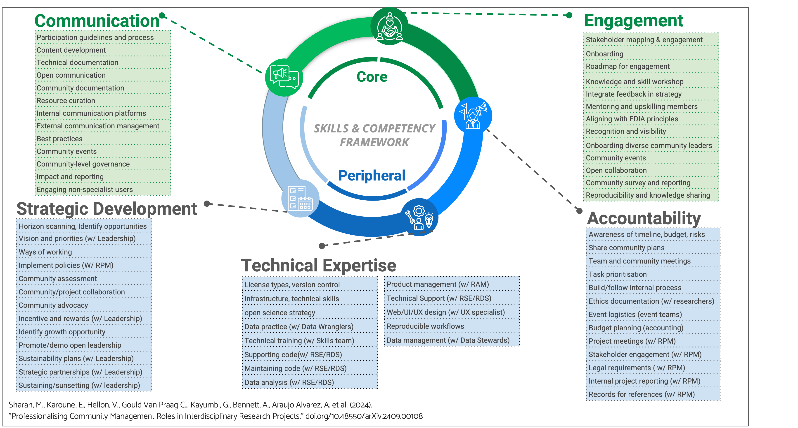
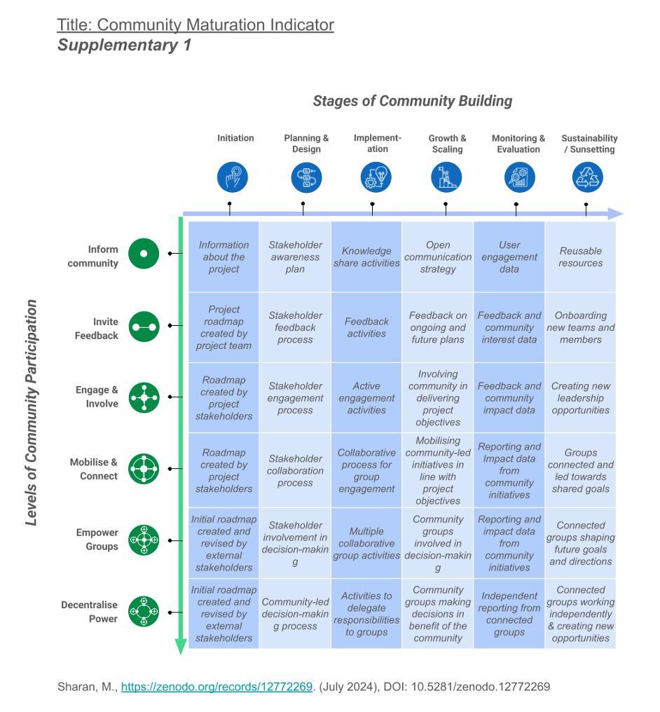

# Blog for SSI RCM 101 Training

## Title: Rise of the Research Community Manager - the next digital RTP

Authors: Emma Karoune, Cassandra Gould van Praag, and Malvika Sharan

## Introduction

Communities are the core of research software and a much broader research ecosystem. Whether researchers deliberately identify with a community or not, they are all part of different overlapping communities. Many SSI Fellows, learning and improving research practices, have experience of not just participating in, but organising communities, and fellows often take their first steps as community leaders through their fellowship projects. 

Community maintenance tasks may be assumed by or delegated to any research roles. However, over the last years, we have seen structured leadership in this area by Research Technical Professional (RTP), particularly Research Community Managers (RCM), who are increasingly being recognised as a core component of the research ecosystem. Nonetheless, there is still much work to do to align the RCM role alongside Research Software Engineers and other digital RTPs in terms of recognition and professionalisation. 

An important step towards achieving recognition and professionalisation of the RCM role, and community work in general, is through group-based training in community management practices, with a goal to build and disseminate shared standards, language and frameworks. Motivated by this clear need, SSI Fellows Emma Karoune and Malvika Sharan, with their colleague Cassandra Gould van Praag, have started a new initiative,[ RCM Cooperative](https://www.rcmcooperative.com/). Focusing on community management skills and capacity, RCM Cooperative provides training, consultancy and strategic advisory support to organisations, while fostering a network of RCMs. 

Through the SSI Further Development initiative, the RCM Cooperative team piloted its 6 hours of “RCM 101” workshops, for current SSI Fellows interested in sharpening their RCM skills. 

## What is a Research Community Manager?

We define RCMs as ‘*professionals responsible for fostering a collaborative environment where a diverse research community can access the socio-technical infrastructure and participatory processes they need to actively engage, get recognition and build shared agency over their work’*. We believe that it is essential to invest in upskilling people in community building approaches so that they can enable the right people and groups to contribute to research and wider data science projects. Rooted in research and real-world experience from building communities, we published our perspectives and resources on RCMs in a recent preprint - [https://doi.org/10.48550/arXiv.2409.00108](https://doi.org/10.48550/arXiv.2409.00108)

The [RCM Cooperative](https://www.rcmcooperative.com/) is a group of community managers dedicated to creating equitable, resilient and collaborative research. We provide training, mentoring and strategic support in inclusive and sustainable community building and management for individuals, teams and organisations. We have undertaken strategy and consultancy work with research and public sector organisations. Piloting the delivery of our training resources with SSI Fellows has been helpful to further scope and refine our training modules and engagement format. 

## RCM 101 Workshops for SSI Fellows

This July and August, supported by the Fellows Further Development Fund, we delivered a series of workshop sessions under the title “Research Community Management 101 ” (RCM101) for SSI Fellows. The two 2-hour introductory workshops were each followed by a 1-hour clinic, covering the fundamental concepts including defining RCMs, RCM skills and competencies, community mapping and strategic advice on community building.

During the training workshops, we introduced foundational resources we have developed to help researchers understand and communicate their RCM work. The first session introduced participants to our Skills and Competency framework for RCMs that defines two core skill areas; engagement and communication; and three peripheral skill areas; strategic development, technical expertise and accountability; necessary for effective community management. 

In the second workshop, we introduced our community maturation index, which helps RCMs to think more strategically about community building through identifying the level of participation in their community necessary to achieve a certain goal, and then think about the stages of community building needed to achieve that level. In their feedback, several participants shared that this part of the training had ‘*good steers about how to elevate community planning*’ and the indicator itself was a* ‘very valuable’* tool.

 

The 1-hour Community Clinic session allowed SSI Fellows to bring their specific community management challenges to discuss with the RCM Cooperative team and other SSI Fellow attendees. Here we practiced active participation and collaboration in unpacking and finding potential solutions for their challenges. The group format provided validation and peer support to our RCM colleagues who so often work alone in their teams.

Feedback about the clinic was particularly positive - one attendee said ‘*the clinic was really useful, the discussions around people's questions provided multiple actionable insights on topics relevant to my own difficulties’*.

## Conclusion

Thank you to the SSI Research Community Manager, Oscar Seip, for collaborating with us and the participants who shared constructive feedback to help us to improve our resources and spread the word about professionalising RCM!

Many participants appreciated the workshop materials, the ‘*friendly vibe*’ and the interactivity of the sessions. Particularly helpful are the comments about our collaborative (Miro board-based) activities which will guide our continual refinement of this offering for different audiences. With important concepts to cover for new community builders, we’re aiming to run different formats of the sessions in the future and plan to run a longer cohort based training programmes with opportunities to dig deeper into the RCM skills and practices. 

All resources from the workshop and clinics can be found in the [RCM Cooperative SSI RCM101 GitHub repo](https://github.com/rcmcooperative/SSI-RCM101-Training#top-of-section) ([https://doi.org/10.5281/zenodo.17477987](https://doi.org/10.5281/zenodo.17477987))

## Call to action

If you are interested in this training for your team or want to get strategic support for your RCM work, get in contact with us through our website for a conversation about how RCM Cooperative can support your teams - [https://www.rcmcooperative.com/](https://www.rcmcooperative.com/).